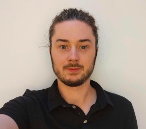

# about-me

### My mission

[comment]: <> 
[comment]: <> 

{: style="float: right"}
As an ocean scientist turned data scientist, I am passionate about using data-driven approaches to solve complex problems. My background in oceanography has given me a strong foundation in scientific research methods, data collection, and analysis. Through my transition to data science, I have gained experience in machine learning, statistical analysis, and data visualization. I am excited to apply these skills to a variety of industries and use data to drive innovation and positive change. 

### My story

### How I've grown

I've undergone a significant professional evolution, transitioning from a career in ocean science to data science. This transition has required me to develop new skills, broaden my knowledge base, and adapt to a new field.
* I have developed my skills, such as Python programming, machine learning, data analysis, and data visualization.
* I have gained new knowledge about data science concepts, tools, and methodologies. I have taken the FastAI course and the Amazon Web Services: Machine Learning course. These courses have given me certifications in data science techniques and enabled me to develpe the projects in this portfolio.

### Who I serve

### What I offer

[comment]: <> This is where you put the contents of your *About* page. Like all your pages, it's in [Markdown](https://guides.github.com/features/mastering-markdown/) format.

