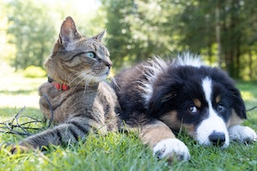

# Projects

Weclome to my portfolio of projects. Here you'll find a posts showcasing the projects I've been working on. My github can be found [here](https://github.com/benbardev).

| Starship Titanic | Cloud Type Classifier | Cat/Dog Breed Identifier |
|---|---|---|
|  |  |  |
| [Link to Project](projects/starship) | [Link to Project](projects/cloud_classifier) | [Link to Project](projects/cat_dog) |
| A decision tree model for predicting missing passangers on the fictional space ship Titanic. | An image classifier for 9 cloud types. | An image classifier for identifying cat and dog breeds. |